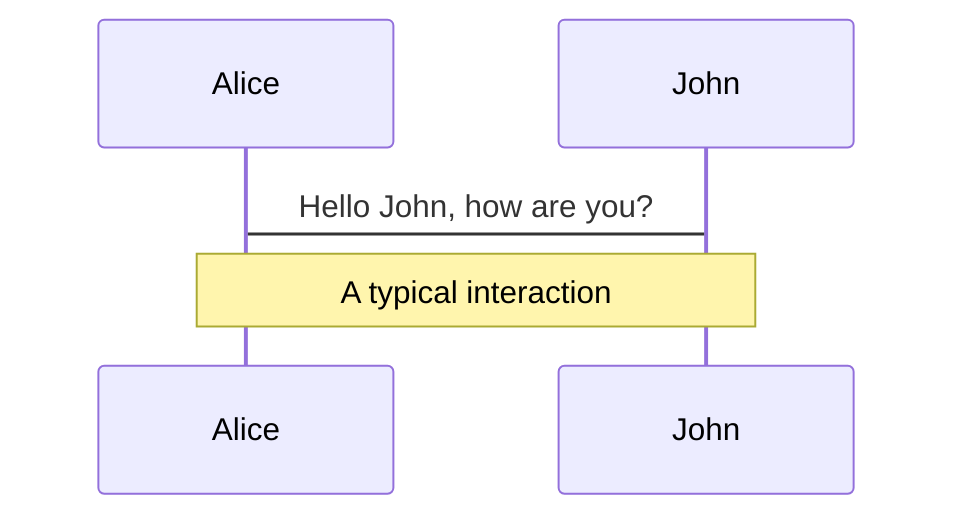
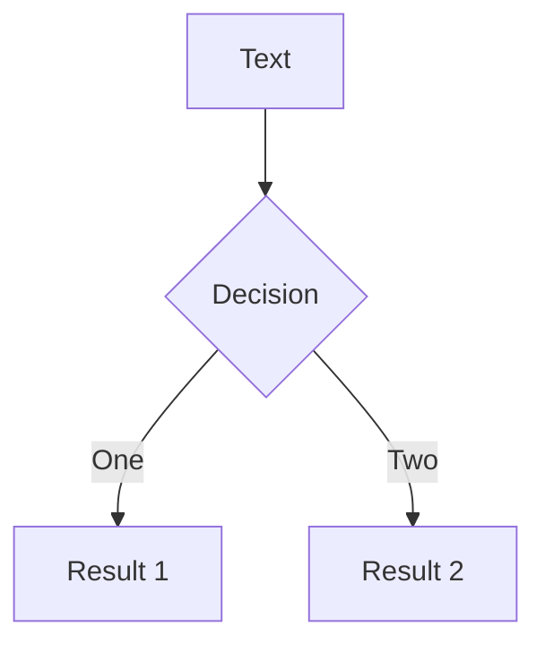
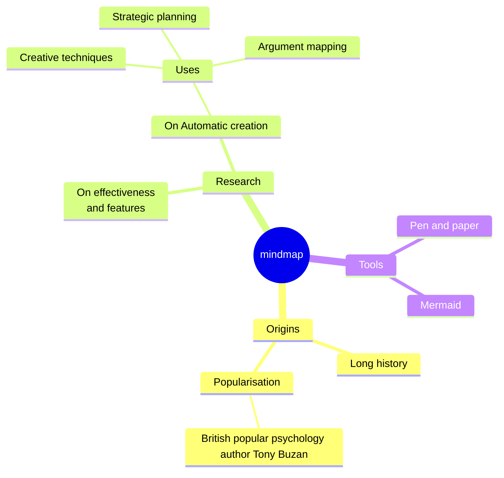

# イケてるスライド作成ツールSlidevを使ってみよう！

<br>

<div style="display: flex; align-items: center; gap: 10px;">
  
  <span style="font-size: 16px; font-weight: bold; padding: 0 10px 0 20px;">2026/02/20<br>vana4</span>
</div>

---

# プレゼン資料作成ってめんどくさいですよね

- 「Googleスライドでコードを貼ると見づらい」
- 「デザインに時間がかかって、内容に集中できない」
- 「スライドのバージョン管理ができない」

<br>

### ・・・

<br>

### **もっとエンジニアらしいやり方、ありますよ。**


---

# 今日お話しすること

<div class="flex flex-col gap-lg">
  <div><span class="step step-green">1</span> Slidevってなに？</div>
  <div><span class="step step-green">2</span> なぜSlidevを使うのか？</div>
  <div><span class="step step-green">3</span> Slidevを始めてみよう</div>
</div>

---
layout: section
---

# 01

## Slidevってなに？

---

# Slidev（スライディブ）とは？

<div class="box box-green-outline">
  💡 <strong>Markdownで書ける、エンジニア向けスライド作成ツール</strong>
</div>

<br>

<div class="flex flex-center gap-lg" style="margin-top: 24px;">
  <div class="flex flex-col">
    <span class="badge badge-lg badge-green" style="width: 150px; height: 150px; font-size: 20px;">Markdown</span>
    <span class="note text-center">コンテンツに集中</span>
  </div>
  <div class="flex flex-col">
    <span class="badge badge-lg badge-green" style="width: 150px; height: 150px; font-size: 20px;">Web技術</span>
    <span class="note text-center">Vue 3 + Vite</span>
  </div>
  <div class="flex flex-col">
    <span class="badge badge-lg badge-green" style="width: 150px; height: 150px; font-size: 20px;">OSS</span>
    <span class="note text-center">無料で使える</span>
  </div>
  <div class="flex flex-col">
    <span class="badge badge-lg badge-green" style="width: 150px; height: 150px; font-size: 20px;">♡ AI</span>
    <span class="note text-center">AIツールと相性良し</span>
  </div>
</div>

---

# Slidevの主な特徴

<div class="flex gap-lg flex-start">
  <div class="bubble bubble-green-outline bubble-tail-bottom" style="flex: 1; font-size: 20px;">
    Shikiによる美しいシンタックスハイライト
  </div>
</div>
<div class="flex gap-lg flex-start">
  <div class="bubble bubble-green-outline bubble-tail-bottom" style="flex: 1; font-size: 20px;">
    ViteベースのHMR（Hot Module Replacement）
  </div>
</div>
<div class="flex gap-lg flex-start">
  <div class="bubble bubble-green-outline bubble-tail-bottom" style="flex: 1; font-size: 20px;">
    PDF / PPTX / Webページとしてエクスポート・公開可能
  </div>
</div>

---

# エンジニア最大のメリット：コードの表現力

<div class="flex flex-col gap-lg">
  <div><span class="step step-green">1</span> Shikiによる高精度シンタックスハイライト</div>
  <div><span class="step step-green">2</span> 行ハイライトで強調表示（複数行の順次ハイライトも可能！）</div>

```ts {all|1|2-4|5}
console.log('Hello World')
function add(a: number, b: number) {
  return a + b;
}
console.log(add(1, 2));
```

  <div><span class="step step-green">3</span> Monaco Editorでライブコーディング（プレゼン中にコード編集可能！）</div>

```ts {monaco}
console.log('Hello World')
function add(a: number, b: number) {
  return a + b;
}
console.log(add(1, 2));
```
</div>

<br>


---
layout: section
---

# 02

## なぜSlidevを使うのか？

---

# 他のツールと比べてみよう

|  | Slidev | Marp | Googleスライド |
|---|---|---|---|
| 記法 | Markdown + Vue | Markdown | WYSIWYG |
| コードハイライト | <span class="marker-green">**あり（高精度）**</span> | あり | 限定的 |
| インタラクティビティ | <span class="marker-green">**高度**</span> | 低い | 普通 |
| Git管理 | 可能 | 可能 | 困難 |
| エクスポート | PDF/PPTX/SPA | PDF/PPTX/HTML | PPTX/PDF |
| 費用 | 無料（OSS） | 無料（OSS） | 有料 |


---

# Slidevが選ばれる理由

<div class="flex flex-col gap-sm">
  <div class="box box-green-outline">
    <strong><span class="marker-green">コードが美しい</span></strong><br>
    <span class="note">Googleスライドにコードを貼り付ける苦痛から解放される</span>
  </div>
  <div class="box box-green-outline">
    <strong><span class="marker-green">Gitで管理できる</span></strong><br>
    <span class="note">バージョン管理、差分確認、チームでの共有が容易</span>
  </div>
  <div class="box box-green-outline">
    <strong><span class="marker-green">Webページとして公開</span></strong><br>
    <span class="note">GitHub Pagesで手軽にスライドを共有できる</span>
  </div>
</div>

<br>

<span class="marker-green">**普段の開発ワークフローの延長でスライドが作れる**</span>

---

# 始める前に知っておきたいこと

<span class="label label-green-fill" style="font-size: 24px; padding: 8px 20px;">知っておくとスムーズ</span>

<br>

- Node.js（>= 18.0）の環境が必要
- Markdownの基本的な書き方の知識は必須
- カスタマイズにはHTML/CSSの知識があると便利

<br>

<div class="flex gap-lg flex-start">
  <div class="bubble bubble-green-outline bubble-tail-bottom" style="flex: 1; font-size: 20px;">
    とはいえ、普段コードを書いているエンジニアなら問題なし！
  </div>
</div>

---
layout: section
---

# 03

## Slidevを始めてみよう

---

# たった1コマンドで始められる

```bash
# pnpm（推奨）
pnpm create slidev

  ●■▲
  Slidev Creator  v0.50.0-beta.7

✔ Project name: … project-name
  Scaffolding project in project-name ...
  Done.

✔ Install and start it now? … yes
✔ Choose the package manager › pnpm
```

<br>

<span class="marker-green">**いくつかの質問に答えるだけでプロジェクトが自動作成される**</span>

---

# プロジェクト作成後の基本操作

<div class="flex flex-col gap-lg">
  <div><span class="step step-green">1</span> プロジェクトフォルダに <em>slides.md</em> が作成されるので編集</div>
  <div><span class="step step-green">2</span> <em>pnpm slidev</em> コマンドで開発サーバーを起動</div>
  <div><span class="step step-green">3</span> ブラウザでリアルタイムにプレビューしながら編集</div>
</div>

<br>

```bash
# 開発サーバー起動
pnpm slidev

# PDFエクスポート
slidev export

# SPAとしてビルド
slidev build
```

---

# スライドの書き方はシンプル

```markdown
---
theme: seriph
---

# 最初のスライド

こんにちは！

---

# 2枚目のスライド

- Markdown で書ける
- `---` で区切るだけ

---
...
```

<br>

<span class="marker-green">**ハイフン3つで区切るだけでスライドが作れる**</span>

---

# Mermaidも使えます

<div class="flex flex-left gap-lg" style="margin-top: 24px;">







</div>

---

# X(Twitter)も埋め込めます

<Tweet
  id="2017524056128684397"
  :scale="0.9"
  conversation="none"
  cards="hidden"
/>

---
layout: section
---

# 04

## まとめ

---

# まとめ

<div class="flex flex-col gap-lg">
  <div><span class="step step-green">1</span><span style="font-size: 22px;"> Slidevは <span class="marker-green"><strong>Markdownで書ける</strong></span> エンジニア向けスライド作成ツール</span></div>
  <div><span class="step step-green">2</span><span style="font-size: 22px;"> <span class="marker-green"><strong>コードの表現力</strong></span> と <span class="marker-green"><strong>Git管理</strong></span> がエンジニアにとって最大のメリット</span></div>
  <div><span class="step step-green">3</span><span style="font-size: 22px;"> <span class="marker-green"><strong>1コマンド</strong></span> で始められ、すぐにスライドを作成できる</span></div>
</div>

<br>

<div class="flex flex-center gap-lg" style="margin-top: 24px;">
  <div class="flex flex-col">
    <span class="badge badge-lg badge-green" style="width: 150px; height: 150px; font-size: 20px;">Markdown</span>
  </div>
  <div class="flex flex-col">
    <span class="badge badge-lg badge-green" style="width: 150px; height: 150px; font-size: 20px;">コード表現</span>
  </div>
  <div class="flex flex-col">
    <span class="badge badge-lg badge-green" style="width: 150px; height: 150px; font-size: 20px;">Git管理</span>
  </div>
</div>

---

# 今日からSlidevを使ってみよう！

次のLTや勉強会の発表では、ぜひSlidevを試してみてください。

<span class="marker-green">**コードを書くように、スライドを書こう。**</span>

<br>

<div class="flex gap-lg flex-start">
  <div class="bubble bubble-green-outline bubble-tail-bottom" style="flex: 1; font-size: 20px;">
    ブラウザで今すぐ試せます
  </div>
</div>

### **https://sli.dev/new**


---
layout: cover
---

# ありがとうございました！
